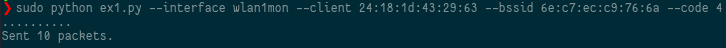
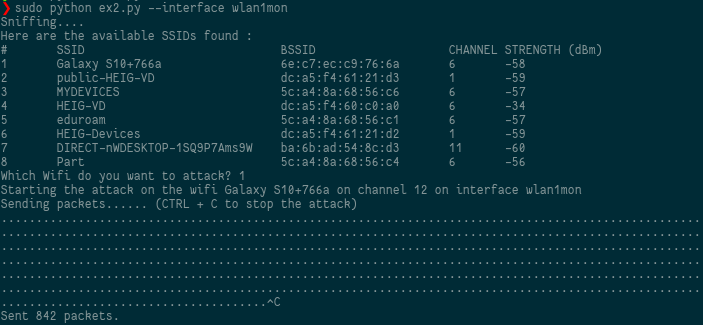

# SWI - Laboratoire 1 - 802.11 MAC 1

## Auteurs : Edin Mujkanovic et Daniel Oliveira Paiva

### 1. Deauthentication attack

#### 1.1 Questions

**Question** : Quel code est utilisé par aircrack pour déauthentifier un client 802.11. Quelle est son interpretation ?

Le code utilisé par aircrack est le **code 7**. 

**Question** : A l'aide d'un filtre d'affichage, essayer de trouver d'autres trames de déauthentification dans votre capture. Avez-vous en trouvé d'autres ? Si oui, quel code contient-elle et quelle est son interpretation ?

Oui, nous avons simulé un code nous même. Nous avons connecté un de nos laptop à un AP et nous avons éloigné l'AP de la STA suffisement loin afin de forcer une déconnexion. Nous avons obtenu le code 4 qui correspond à "Disassociated due to inactivity".

**Question** : Quels codes/raisons justifient l'envoie de la trame à la STA cible et pourquoi ?

Les codes 1 et 5 sont envoyés à la STA. En effet, le code 1 peut être envoyé dans les deux directions et le code 5 est envoyé par l'AP à la STA lorsque l'AP ne peut pas gérer toutes les connections.

**Question** : Quels codes/raisons justifient l'envoie de la trame à l'AP et pourquoi ?

Les codes 1, 4 et 8 sont envoyées à l'AP. Le code 4 est envoyé lorsque l'AP ne répond plus (lorsqu'on s'éloigne avec un téléphone par exemple) et le code 8 est envoyé lorsque la STA quitte la BSS et informe l'AP.

**Question** : Comment essayer de déauthentifier toutes les STA ?

Afin de désauthentifier toutes les STA, il faudrait lister toutes leur MAC adresses et effectuer une *deauthentication attack* sur toutes les STA. Il suffirait de faire une boucle sur toutes les adresses MACs.

**Question** : Quelle est la différence entre le code 3 et le code 8 de la liste ?

Le code 8 se produit lorsqu'une erreur survient entre l'association et  l'échange de clé. Le nom de la raison "Leaving_network_deassoc".

Le code 3 se produit lorsque la STA et l'AP ont déjà effectué l'authentification. Le nom de la raison par défaut est "Leaving_network_deauth".

**Question** : Expliquer l'effet de cette attaque sur la cible.

L'attaque permet de déauthentifier une cible d'un access point spécifique.

##### 1.2 Fonctionnement du script

Afin d'exécuter le script, il suffit de spécifier l'interface utilisée, l'adresse MAC du client, l'adresse MAC de l'AP ainsi que le code (1, 4, 5 ou 8). Le script va envoyé 10 paquets afin désauthentifier le client.

### 2. Fake channel evil tween attack

##### 2.1 Questions

**Question** : Expliquer l'effet de cette attaque sur la cible.

L'attaquant usurpe l'AP en broadcastant intensivement son beacon avec un channel différent. L'attaquant envoyant des paquets à grande fréquence, les victimes auront plus de chance de se connecter à l'attaquant afin de voler des informations de connexion de ceux-ci.

##### 2.2 Fonctionnement du script

Afin d'utiliser le script, il suffit d'exécuter le script ex2 en spécifiant l'interface avec l'argument `--interface`. 

Le script va ensuite scanner les wifis disponibles et les lister afin que l'utilisateur puisse entrer le numéro du wifi dont il souhaite faire un "jumeau". Ensuite, l'attaque va se lancer sur le wifi sélectionné par l'utilisateur.

### 3. SSID flood attack

##### 3.1 Fonctionnement du script

Afin de lancer le script, nous pouvons ecrire les noms des wifis que l'on souhaite créé : 

Après avoir écrit les noms de wifis, on peut exécuter le script en spécifiant l'interface et le fichier contenant les noms de wifis que l'on souhaite générer : 

Le script va se lancer : 

Et on peut voir les résultats sur n'importe quel appareil: 

Si l'on souhaite générer des noms de wifis aléatoires, il suffit de taper la commande : 

